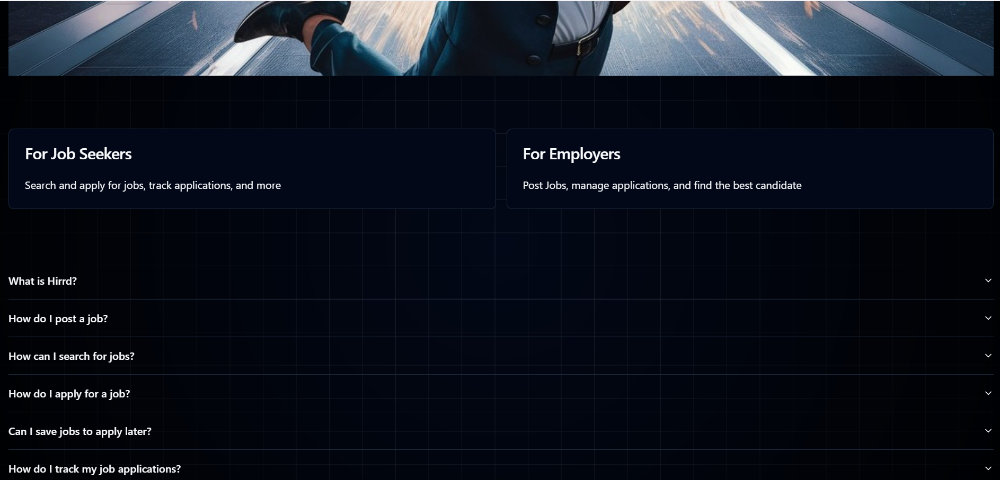
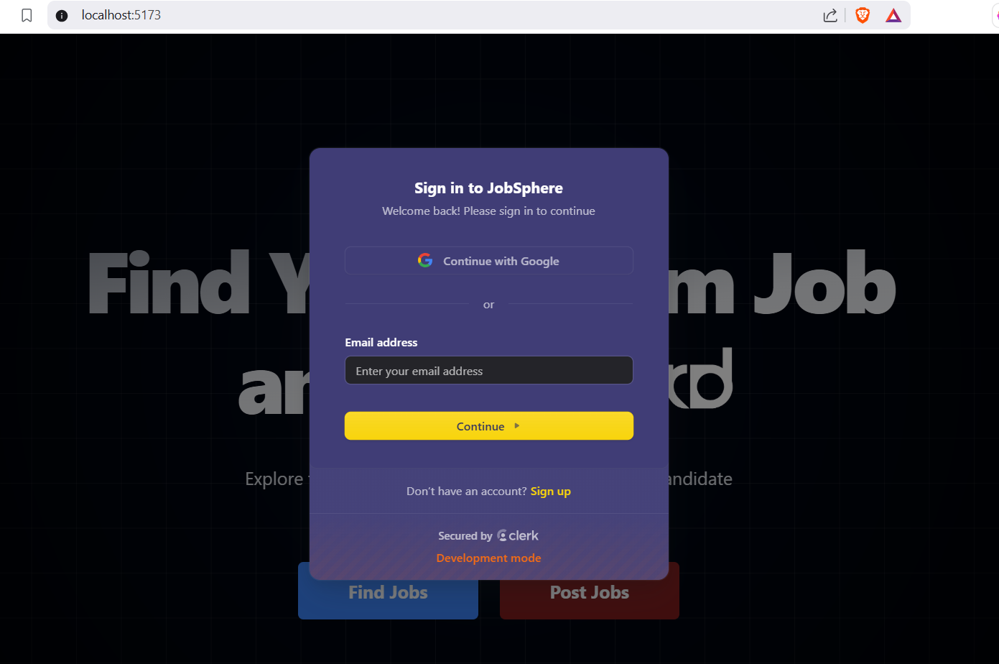
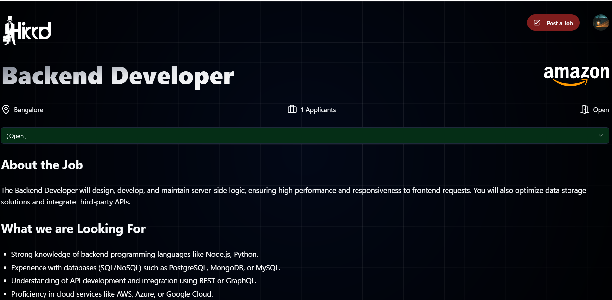
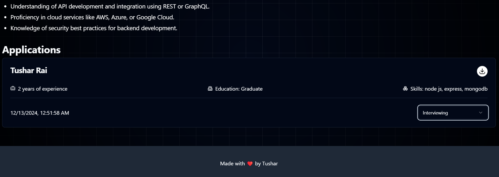

# ✨ Hirrd - Job Portal

## 📌 Overview
**Hirrd** is a **modern job portal** built using **React.js, Shadcn UI, Supabase, Tailwind CSS, and Clerk**. It enables job seekers and recruiters to seamlessly connect through an intuitive interface.

## 🚀 Features
- 💼 **User Authentication**: Secure login/signup with **Clerk**.
- 🌐 **Job Listings**: Browse and search for available jobs.
- 💡 **Job Application**: Apply for jobs easily with a single click.
- 🔄 **Role-based Dashboard**:
  - **Admin**: Manage job postings, user roles, and applications.
  - **Recruiters**: Post jobs, view applicants, and manage listings.
  - **Job Seekers**: Search, filter, and apply for jobs.
- 📊 **Responsive UI**: Built with **Shadcn UI & Tailwind CSS**.
- 📁 **Database Management**: Uses **Supabase** for real-time data storage.

## 🦐 Tech Stack
- **Frontend:** React.js, Shadcn UI, Tailwind CSS
- **Backend & Database:** Supabase
- **Authentication:** Clerk
- **Styling:** Tailwind CSS

## 🖼️ Screenshots
### Home Page
 
 
 
### Login Page

### Find Jobs

### Job description




## 📺 Installation & Setup
```bash
# Clone the repository
git clone https://github.com/tushargithub52/Hirrd-Job-Portal.git

# Navigate to the project folder
cd Hirrd-Job-Portal

# Install dependencies
npm install

# Create a .env file and add required API keys (Supabase, Clerk, etc.)

# Start the development server
npm run dev
```

## 🚀 Usage
- 💼 **Admin**: Manage jobs and users.
- 👨‍💼 **Recruiters**: Post and manage job listings.
- 👨‍💻 **Job Seekers**: Search and apply for jobs.

## 📝 Future Enhancements
- 🌐 **Real-time Notifications** for job updates.
- 🔧 **AI-based Job Recommendations**.
- 🛠️ **Resume Parsing & Profile Enhancement**.

## 📞 Contact
👤 **Tushar Rai**  
📧 [tusharraiku6020@gmail.com]  
🔗 [LinkedIn](https://www.linkedin.com/in/tushar-rai-7801a4254/)  
